# SlimCal App

## Overview
The *Spring Calorie App* is a web-based application for tracking and managing calorie intake. It allows users to register, log in, and maintain a diary of their food entries while providing insights through various stats and summaries. An admin menu is available for managing user entries and statistics.

## Features

### User Features
- *User Registration and Login:*
    - Register with a unique email and password.
    - Secure login with Spring Security.

- *Dashboard:*
    - View and select:
        - *Daily Stats:* Summary of calorie and cost for the current day.
        - *Weekly Summary:* Aggregate stats for the past 7 days.
        - *Today's Entries:* Detailed list of food entries for the day.

- *Insert Food Entry:*
    - Log food entries by specifying:
        - Food name.
        - Calorie count.
        - Price.

- *Diary:*
    - Filter food entries by a specific date range.

### Admin Features
- *Admin Menu:*
    - Manage user statistics.
    - Modify or delete user food entries.
    - Access all user activity logs.

## Technologies Used
- *Backend:* Spring Framework (Spring Boot)
- *Database:* MySQL
- *Frontend:* Thymeleaf, HTML, CSS, JavaScript
- *Authentication:* Spring Security
- *ORM:* Hibernate

## Setup Instructions

### Prerequisites
Ensure the following are installed on your system:
- Java (JDK 11 or later)
- MySQL Server
- Maven

### Steps to Set Up
1. *Clone the Repository*
   bash
   git clone https://github.com/mirsalda/SlimCal.git
   cd SlimCal

2. *Configure the Database*
    - Create a MySQL database:
      sql
      CREATE DATABASE slimcal;

    - Update application.properties file in src/main/resources with your MySQL credentials:
      properties
      spring.datasource.url=jdbc:mysql://localhost:3306/slimcal
      spring.datasource.username=your_mysql_username
      spring.datasource.password=your_mysql_password

      spring.jpa.hibernate.ddl-auto=update

3. *Build the Application*
   bash
   mvn clean install

4. *Run the Application*
   bash
   mvn spring-boot:run

5. *Access the Application*
   Open a browser and go to: http://localhost:8080

## License
This project is licensed under the MIT License. See LICENSE for more details.
---
*Contributors:*
- Gerald Lita ([geraldl04](https://github.com/geraldl04))
- Mirsalda Dauti ([mirsalda](https://github.com/mirsalda))
- Samanta Afesllari ([SamantaAfesllaricmd](https://github.com/SamantaAfesllaricmd))
- Stiven Rreza ([stivenrreza](https://github.com/stivenrreza))

## Screenshots

### Code Coverage
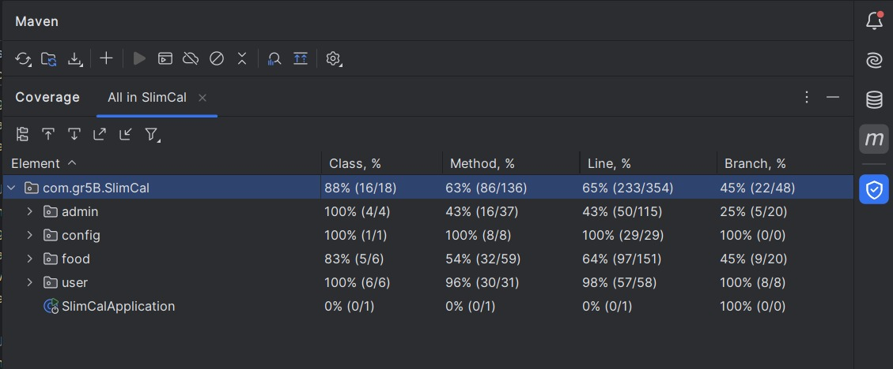

### Login Page

### Register Page
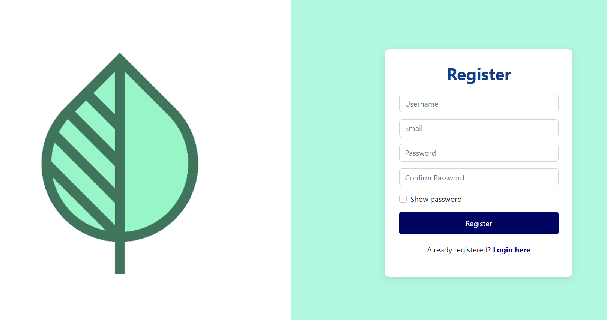

### User Dashboard
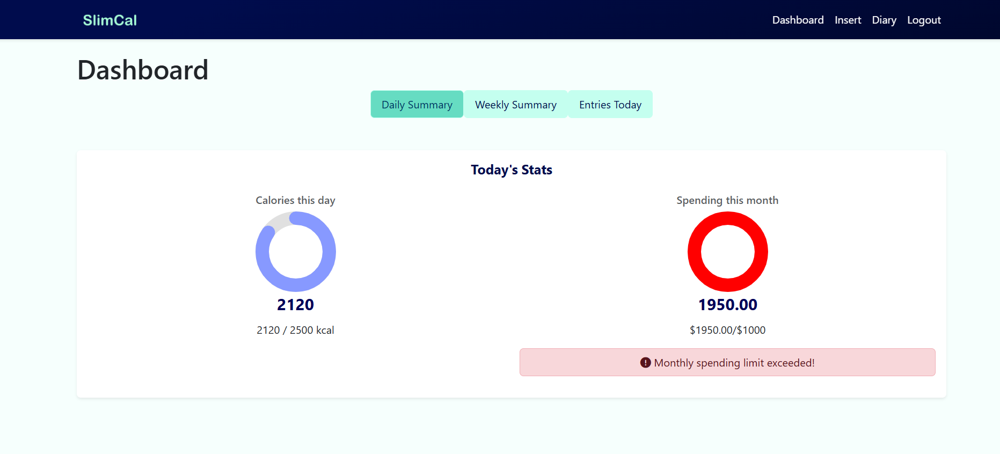

### Food Entry Form
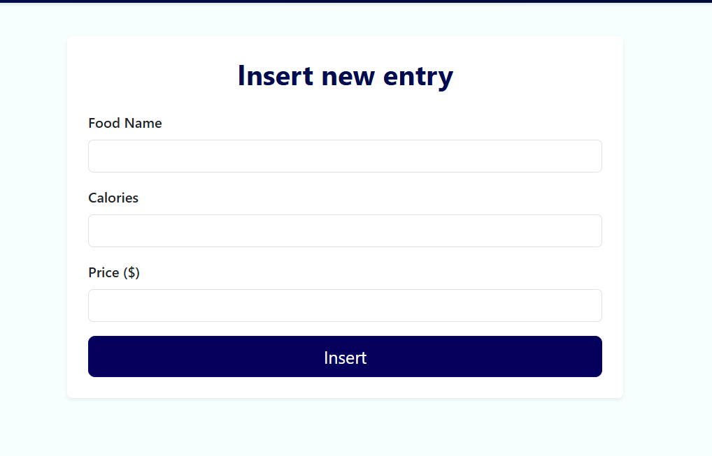

### User Food Entries
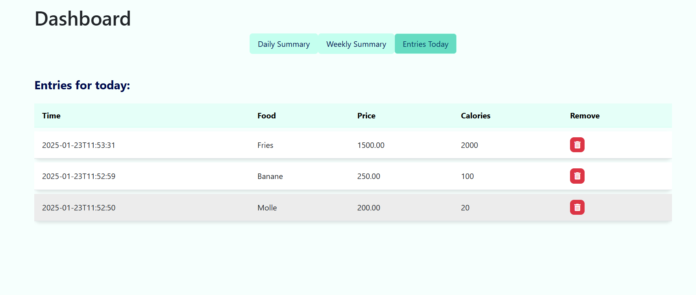

### User Weekly Summary
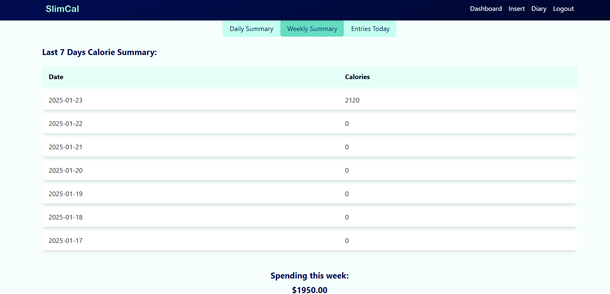

### User food diary
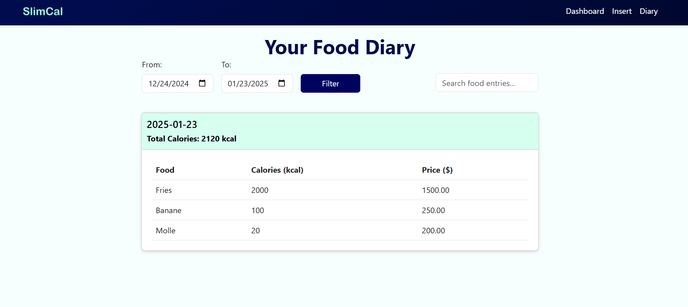

### Admin Dashboard
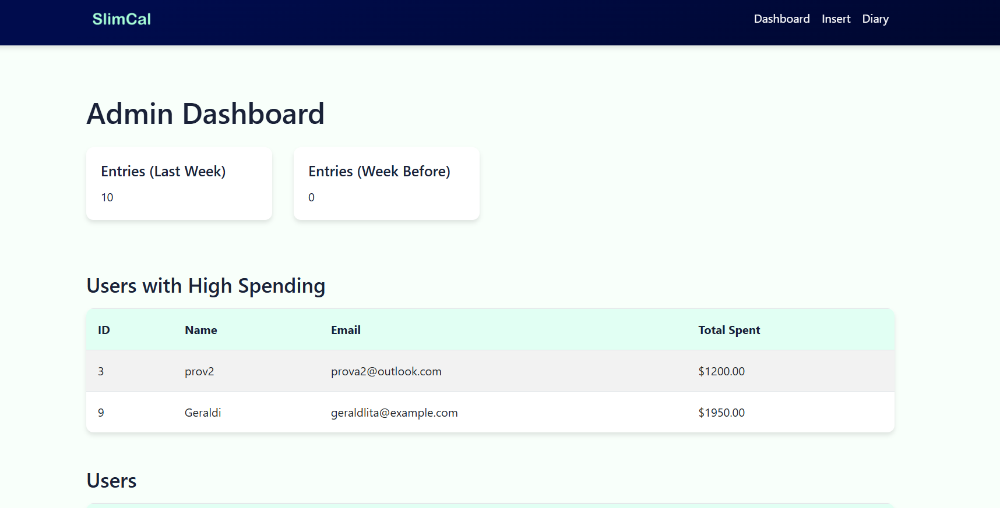
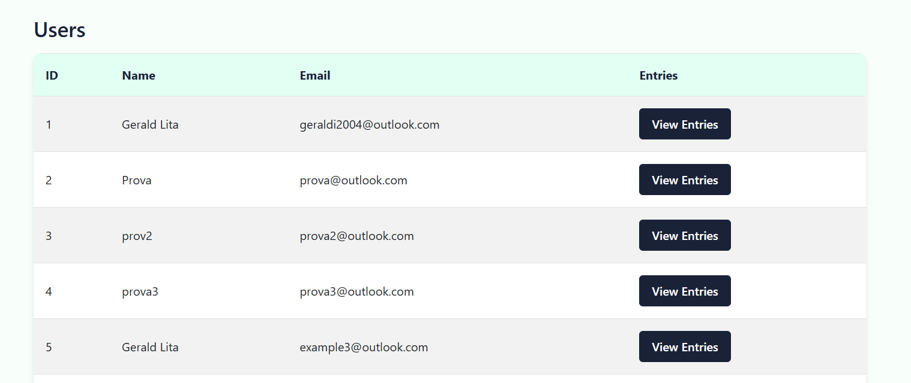

## View entry Admin
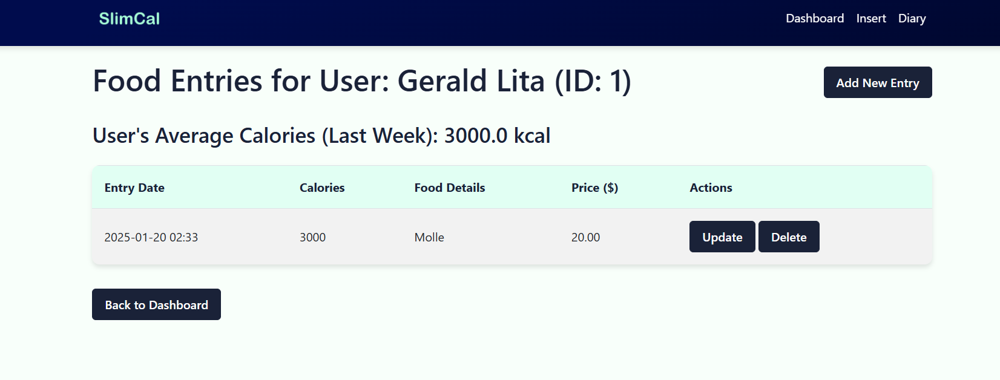

### Add food entry admin
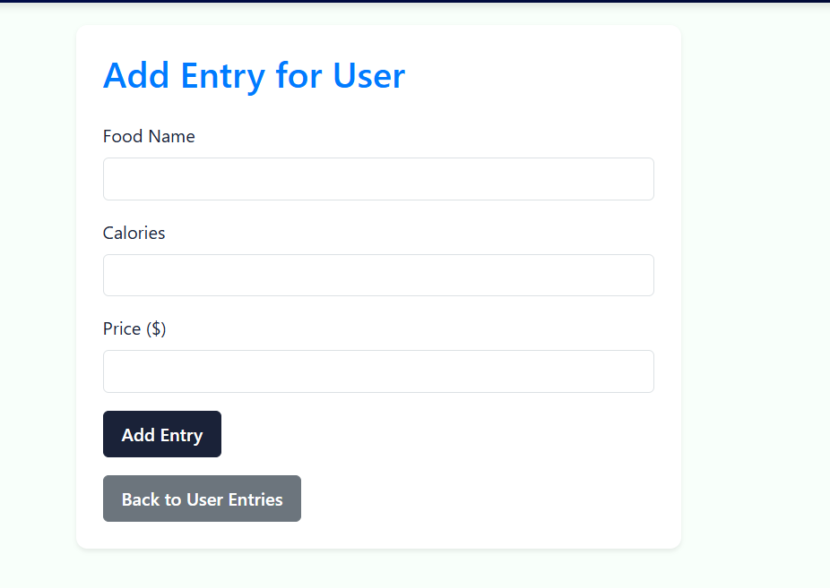